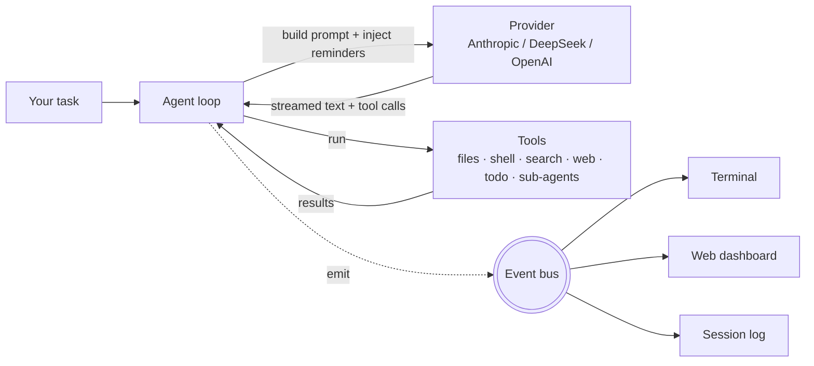

<div align="center">

# 🔍 glassbox

### Watch an AI coding agent *think.*

**A tiny, fully‑readable coding agent — with a live web dashboard that x‑rays every prompt, tool call, token and dollar, in real time.**

Most AI coding tools are black boxes. `glassbox` is the opposite: a ~1,000‑line, Claude‑Code‑style agent you can actually read, plus a real‑time panel that shows you *exactly* what it's doing — every token streamed from the model, every tool it runs, every reminder the harness injects, and how much it all costs.

[](https://github.com/laniakeaoverflow/glassbox/actions/workflows/ci.yml)
[](LICENSE)


[Quickstart](#-quickstart) · [What you see](#-what-the-dashboard-shows-you) · [How it works](#-how-it-works) · [中文](README.zh.md)

</div>

<!-- TIP: docs/banner.svg is a placeholder — replacing it with a real dashboard screenshot or GIF is the single biggest driver of stars. -->
<p align="center">
  
  <br><sub><i>The live dashboard — conversation flow, every LLM call (with raw request/response), tool calls, the plan (todo) panel, context usage, and the multi‑agent tree.</i></sub>
</p>

---

## ✨ Why glassbox

- 🔬 **See inside the black box.** A live dashboard streams the agent's every step — the full input sent to the model, its response **token‑by‑token**, each tool call's arguments and results, latency, tokens, and estimated cost.
- 🪄 **Watch the *harness*, not just the model.** glassbox makes the framework's hidden moves visible: context **compaction**, and the `<system-reminder>` blocks it **injects** mid‑conversation (git status, the live todo list) to steer the model. This framework↔model interplay is exactly what's invisible in every other tool.
- 🧠 **Learn how coding agents actually work.** The whole loop is ~1,000 lines of plain, commented TypeScript — no agent framework, no magic. If you've wondered how Claude Code / Cursor‑style agents work under the hood, read this.
- 🔌 **Compare providers head‑to‑head.** Anthropic, DeepSeek, and any OpenAI‑compatible API. Switch live with `/model` and watch a different model handle the *same* task — speed, cost, and protocol differences side by side. (Same harness, different model = a controlled way to feel the model‑vs‑harness gap.)
- 🛠️ **It actually does work.** Real tools: read/write/edit files, run shell commands, start servers in the background, search code, fetch the web, track a **todo plan**, and spawn sub‑agents.
- 📼 **Every run is recorded.** Each session writes a human‑readable `.log` and a complete `.jsonl` so you can replay and debug exactly what happened — try it with **no API key**.
- 🧠 **Memory across sessions.** A `GLASSBOX.md` you write, plus a `remember` tool the agent uses to save its own learnings — both auto‑load next time (à la Claude Code's `CLAUDE.md`).
- 🌐 **Bilingual dashboard** (中文 / English) and a **hand‑built raw‑mode terminal UX** (bracketed‑paste multiline + arrow‑key model picker, no `readline`).

---

## ▶️ Try it instantly — no API key

Want to see the dashboard before signing up for anything? Replay a bundled recording:

```bash
git clone https://github.com/laniakeaoverflow/glassbox.git && cd glassbox
npm install
npm run replay          # then open http://127.0.0.1:4100
```

This plays a real recorded session back into the dashboard — click any LLM call to inspect its full input/output. No key, no cost.

---

## 🚀 Quickstart

> Ready to run it for real? You only need two things: **Node.js** and **one API key**. ~3 minutes.

**1. Install [Node.js 20+](https://nodejs.org/)** (if you don't have it).

**2. Get the code & dependencies:**

```bash
git clone https://github.com/laniakeaoverflow/glassbox.git
cd glassbox
npm install
```

**3. Add an API key.** The cheapest/easiest to start with is **[DeepSeek](https://platform.deepseek.com/)** (a few cents goes a long way):

```bash
cp .env.example .env
# open .env and set:  PROVIDER=deepseek  and  DEEPSEEK_API_KEY=sk-your-key
```

> An "API key" is just a password that lets the app talk to an AI model. DeepSeek/OpenAI/Anthropic each give you one on their website.

**4. Run it:**

```bash
npm run dev
```

Then open the dashboard at **http://127.0.0.1:4100**, type a task in the terminal (e.g. *"build a snake game in a single HTML file"*), and watch it work in real time.

> Want it everywhere? `npm run build && npm link` gives you a global `glassbox` command you can run in any folder.

---

## 👀 What the dashboard shows you

| View | What it tells you |
|---|---|
| **① Conversation flow** | The whole timeline: your task, the agent's replies **streaming in live**, every tool it runs, and the `💉 injected` system‑reminders the harness adds |
| **② LLM calls** | Each model call — provider, model, latency, tokens in/out, cost. **Click any call to see the complete input and output** sent over the wire |
| **③ Tool calls** | Every tool: name, arguments, result, duration, success/failure |
| **④ Plan (todo)** | The agent's live checklist via `todo_write` — watch it tick `[ ] → [~] → [x]` as it works |
| **⑤ Multi‑agent tree** | When the main agent spawns sub‑agents, watch the tree grow |

The killer feature: **click an LLM call and see the exact, complete request and response** — the system prompt, the full message history, the tool definitions, and the raw provider reply. With streaming on, you also see text and **tool‑call arguments assemble character‑by‑character** as they arrive. It's the clearest way to *understand* what an agent really exchanges with a model on every turn.

---

## 🧩 How it works

The whole thing is one idea: **an event bus is the spine.** The agent loop emits an event at every step; the terminal, the dashboard, and the session log are all just subscribers.



The core loop is a simple `while`: inject any pending reminders → stream the system prompt + history to the model → it replies with text and/or **tool calls** → run the tools → feed results back → repeat until it's done. A **sub‑agent is just the same loop running again** with a focused task. That's the entire "intelligence" — a good loop, a good set of tools, good prompts, and a harness that keeps the model on track.

📖 The best file to read is [`src/agent/loop.ts`](src/agent/loop.ts).

---

## 🧠 Memory

LLMs are stateless — every session starts blank. glassbox keeps two kinds of memory, both auto‑loaded into the system prompt at startup (modeled on Claude Code):

- **You write it** — drop a `GLASSBOX.md` in your project (or `~/.glassbox/GLASSBOX.md` for all projects) with build commands, conventions, preferences.
- **The agent writes it** — it has a `remember` tool that appends learnings to a per‑project `MEMORY.md`, which loads back next time.

Type `/memory` to see what's loaded and where it lives.

---

## 📁 Project structure

```
src/
  agent/loop.ts        ★ the reentrant agent loop (main + sub-agents)
  agent/system-prompt.ts   tuned system prompt (tool discipline, todo, conventions)
  agent/env-context.ts     startup git/cwd snapshot injected as a system-reminder
  agent/compaction.ts      summarize old history when the window fills up
  events/              the event bus (spine) + typed events
  providers/           Anthropic + OpenAI-compatible adapters (streaming), pricing/limits
  tools/               read/write/edit, bash (+ background), search, web_fetch, todo, sub-agent
  ui/                  raw-mode line editor, key decoder, arrow-key picker, printer
  logging/             per-session .log + .jsonl recorder
  dashboard/           SSE server + vanilla-JS frontend (5 views + raw I/O modal)
  index.ts             CLI entry — wires it all together
test/                  unit tests for the pure logic (no API key needed)
```

Run the tests (no key required): `npm test`.

---

## 🗺️ Roadmap

- [x] Detect truncated tool calls + validate required tool args (no more junk writes)
- [x] Context compaction when the window fills up
- [x] **Streaming responses** — token‑by‑token text and live tool‑call assembly
- [x] **`todo_write`** plan tracking with a live dashboard panel
- [x] **`<system-reminder>` injection** — the harness steers the model mid‑run (git status, todo state)
- [x] Browse past session logs in the dashboard (replay)
- [x] `web_fetch` tool — the agent can read the web
- [ ] Edit discipline — discourage whole‑file rewrites (SWE‑agent‑style ACI guardrails)
- [ ] `web_search` tool + prompt caching

Contributions welcome — pick anything above or open an issue. ⭐ a star helps a lot!

---

## 🤝 Contributing

PRs and issues are welcome. The codebase is intentionally small and readable — a great place to learn or to try your first open‑source contribution. Keep changes focused, run `npm test`, and match the surrounding style.

## 📄 License

[MIT](LICENSE) — do whatever you want, no warranty.

## ⚠️ Disclaimer

`glassbox` is an **independent, educational project** built to learn how agentic coding tools work. It is **not affiliated with, endorsed by, or connected to Anthropic**. It is *inspired by* the design of Claude Code; "Claude" and "Claude Code" are trademarks of Anthropic. Use your own API keys at your own cost and risk.

<div align="center">
<sub>Built to be read. If it helped you understand agents, drop a ⭐.</sub>
</div>
