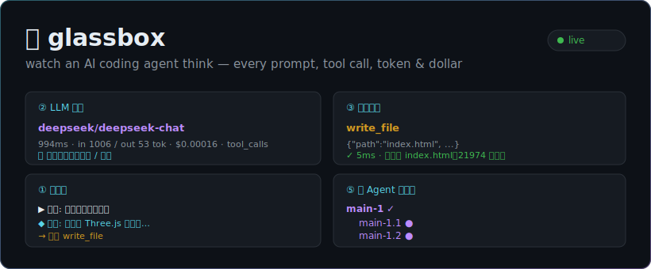

<div align="center">

# 🔍 glassbox

### 亲眼看着一个 AI 编程 agent *思考*

**一个极小、完全可读的编程 agent —— 配一个实时网页面板，把每一次模型调用、工具调用、token 和花费都"透视"给你看。**

大多数 AI 编程工具是黑盒。`glassbox` 反过来：约 1000 行、仿 Claude Code 的 agent，代码你真能读懂；再加一个实时面板，让你**清清楚楚**看到它在干什么——发给模型的每一句话、跑的每一个工具、花了多少钱。

[](https://github.com/laniakeaoverflow/glassbox/actions/workflows/ci.yml)
[](LICENSE)


[快速上手](#-快速上手) · [面板看什么](#-面板能看到什么) · [工作原理](#-工作原理) · [English](README.md)

</div>

<p align="center">
  
  <br><sub><i>实时面板：对话流、每次模型调用（含原始请求/响应）、工具调用、上下文占用、多 agent 协作树。</i></sub>
</p>

---

## ✨ 为什么是 glassbox

- 🔬 **看穿黑盒。** 面板实时流式展示 agent 的每一步：发给模型的完整输入、模型的原始回复、每个工具调用的参数和结果、延迟、token、估算成本。
- 🧠 **真正搞懂编程 agent 怎么工作。** 整个 agent 循环就是约 1000 行朴素、带注释的 TypeScript——没有框架、没有魔法。一直好奇 Claude Code / Cursor 这类 agent 底层咋跑的？读它就懂了。
- 🔌 **多家模型同台对比。** Anthropic、DeepSeek、任意 OpenAI 兼容接口。用 `/model` 实时切换，看不同模型处理**同一个任务**——速度、成本、协议差异一目了然。
- 🛠️ **它是真能干活的。** 读写改文件、跑 shell 命令、后台起服务器、搜代码、派生子 agent。能做出真东西（我们让它写出了一个能玩的 3D 网页游戏）。
- 📼 **每次运行都有记录。** 每个会话写一份可读 `.log` 和一份完整 `.jsonl`，方便回放和排查。
- 🌐 **面板中英双语。** 顶部一键切换中文 / English（默认跟随浏览器语言）。
- 🧠 **跨会话记忆。** 在 `GLASSBOX.md` 里写笔记，或让 agent 用 `remember` 工具记下它学到的经验——两者下次启动都自动加载，不再「失忆」（仿 Claude Code 的 `CLAUDE.md` + auto-memory）。
- ⌨️ **手写的终端交互。** 从零实现的 raw-mode 行编辑器，支持粘贴多行、方向键选模型——没用 `readline`。

---

## ▶️ 零门槛试玩 —— 不需要 API key

想先看看面板长啥样、又不想注册任何东西？回放一份内置录像就行：

```bash
git clone https://github.com/laniakeaoverflow/glassbox.git && cd glassbox
npm install
npm run replay          # 然后打开 http://127.0.0.1:4100
```

它会把一段真实录制的会话重放进面板——点任意一次 LLM 调用就能看完整的输入/输出。无 key、零成本。

---

## 🚀 快速上手

> 想真正跑起来？只需两样东西：**Node.js** 和**一个 API key**。约 3 分钟。

**1. 装 [Node.js 20+](https://nodejs.org/)**（如果还没有）。

**2. 拿代码、装依赖：**

```bash
git clone https://github.com/laniakeaoverflow/glassbox.git
cd glassbox
npm install
```

**3. 配一个 API key。** 上手最便宜方便的是 **[DeepSeek](https://platform.deepseek.com/)**（几分钱就能玩很久）：

```bash
cp .env.example .env
# 打开 .env，填：  PROVIDER=deepseek   DEEPSEEK_API_KEY=sk-你的key
```

> "API key" 就是一串密码，让这个程序能去调用 AI 模型。DeepSeek/OpenAI/Anthropic 各自的官网都能领。

**4. 跑起来：**

```bash
npm run dev
```

然后浏览器打开面板 **http://127.0.0.1:4100**，在终端里输入一个任务（比如 *"用单个 HTML 文件写一个贪吃蛇游戏"*），实时看着它干活。

> 想在任意文件夹用？`npm run build && npm link` 会给你一个全局命令 `glassbox`。

---

## 👀 面板能看到什么

| 视图 | 告诉你什么 |
|---|---|
| **① 对话流** | 整条时间线：你的任务、agent 的回复、它跑的每个工具 |
| **② LLM 调用** | 每次模型调用——provider、模型、延迟、token、成本。**点任意一次就能看到完整的输入和输出** |
| **③ 工具调用** | 每个工具：名称、参数、结果、耗时、成败 |
| **④ 上下文占用** | 模型的上下文窗口用到多满 |
| **⑤ 多 agent 协作树** | 主 agent 派生子 agent 时，看协作树长出来 |

杀手级功能：**点开一次 LLM 调用，看到一字不差的完整请求和响应**——系统提示、完整对话历史、工具定义、模型原始回复。这是理解"agent 每一轮到底给模型发了什么"最直观的方式。

---

## 🧩 工作原理

整个项目就一个核心思想：**事件总线是脊柱。** agent 循环每走一步就发一个事件；终端、面板、会话日志全都只是订阅者。

核心循环就是一个简单的 `while`：把系统提示+历史发给模型 → 它回文本和/或**工具调用** → 执行工具 → 把结果塞回去 → 重复，直到完成。而**子 agent 就是同一个循环再跑一遍**，换个聚焦的任务。所谓"智能"，就是一个好循环 + 一组好工具 + 一段好提示。

📖 最值得读的文件是 [`src/agent/loop.ts`](src/agent/loop.ts)。

---

## 🗺️ 路线图

- [x] 检测被截断的工具调用 + 校验必填参数（不再写出垃圾文件）
- [x] 上下文写满时自动压缩
- [ ] 流式响应，面板逐 token 更新
- [x] 在面板里浏览/回放历史会话日志
- [x] `web_fetch` 工具（agent 能上网读资料）
- [ ] 更多工具（apply-patch、网页搜索）

欢迎贡献——挑上面任意一条，或开个 issue。点个 ⭐ 对项目帮助很大！

## 📄 许可证

[MIT](LICENSE) —— 随便用，不担保。

## ⚠️ 免责声明

`glassbox` 是一个**独立的教育性项目**，用来学习 agentic 编程工具的原理。它**与 Anthropic 无任何关联、未获其背书**。它的设计*受* Claude Code 启发；"Claude" 和 "Claude Code" 是 Anthropic 的商标。请使用你自己的 API key，自负费用与风险。
